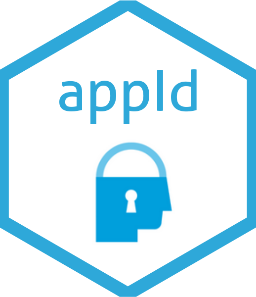

```{r setup, include=FALSE}
knitr::opts_chunk$set(echo = TRUE, warning = FALSE, message = FALSE)

source("man/figures/hexsticker.R")

```

# appId 

<!-- badges: start -->
[](https://www.tidyverse.org/lifecycle/#experimental)
[](https://github.com/th1460/appId/actions)
<!-- badges: end -->

The `appId` is a package to get authentication with [App ID IBM](https://www.ibm.com/cloud/app-id) service in the Shiny Apps.

## Install

```{r eval=FALSE}

remotes::install_github("th1460/appId")

```

## Configure

In the first, you need generate a config yaml file with:

```{r eval=FALSE}

gen_appid_config(name = "Myapp")

```

And resulting

```
# appid_config.yml

name: Myapp
config:
  key: !expr Sys.getenv("APPID_KEY")
  secret: !expr Sys.getenv("APPID_SECRET")
  redirect_uri: !expr Sys.getenv("APP_URL")
  base_url: !expr Sys.getenv("APPID_URL")
  authorize: authorization
  access: token
  scope: openid
  password: !expr Sys.getenv("SECRET") # encrypt token

```

You should too, create a `.Renviron` file with the credentials.

## Example

```{r eval=FALSE}

require(shiny)
require(shinydashboard)
require(appId)

ui <- dashboardPage(
  dashboardHeader(user_info(), # show user info
                  title = "My dashboard"),
  dashboardSidebar(),
  dashboardBody()
)

server <- function(input, output, session) {

  # if you want get user info in app
  userinfo <- callModule(get_user_info, "userinfo")
  output$user <- renderText({userinfo()})

}

# modified shinyApp
shinyAppId(ui, server)

```

## References

1. Package [curso-r/auth0](https://github.com/curso-r/auth0)
2. Gist [hadley/shiny-oauth.r](https://gist.github.com/hadley/144c406871768d0cbe66b0b810160528)
